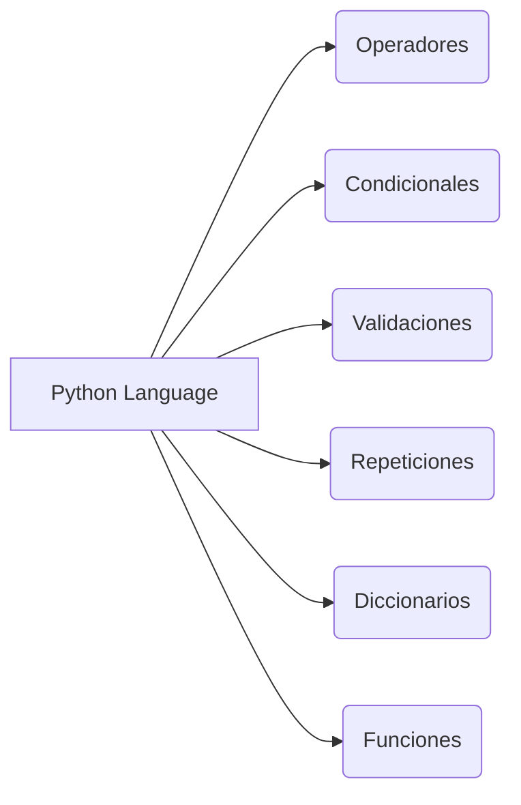
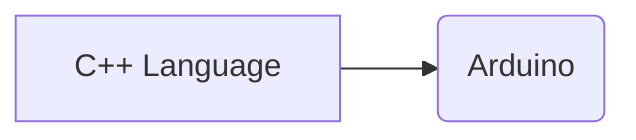

#  Bienvenidos a UTN Development Area

Buenas! Este repositorio es exclusivamente para la Facultad UTN Avellaneda, principalmente orientado a las materias de Programacion y Desarrollo.

#  Materias:
* ###  Programacion I
>  **Nota:** Actualmente se actualiza por semana dado que esta en curso

- Desafio Stark Industries

https://docs.google.com/document/d/13c882sQnZBH1D5DdploK4mFeJGfmoaygaG-oeo_TNIU/edit

* ###  Sistema de Procesamiento de Datos
>  **Nota:** Actualmente se actualiza por semana dado que esta en curso

Docs: https://www.arduino.cc/reference/en/

