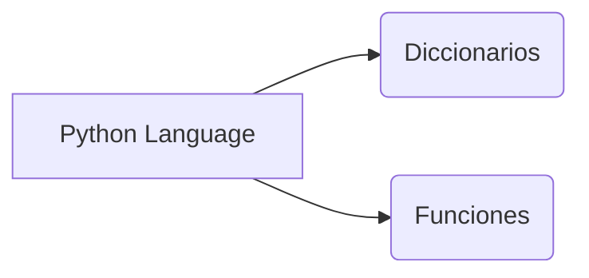
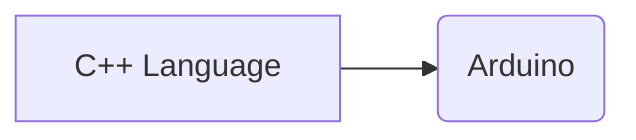

#  Bienvenidos a UTN Development Area

Buenas! Este repositorio es exclusivamente para la Facultad UTN Avellaneda, principalmente orientado a las materias de Programacion y Desarrollo.

#  Materias:
* ###  Programacion I
>  **Nota:** Actualmente se actualiza por semana dado que esta en curso

* ###  Sistema de Procesamiento de Datos
>  **Nota:** Actualmente se actualiza por semana dado que esta en curso
